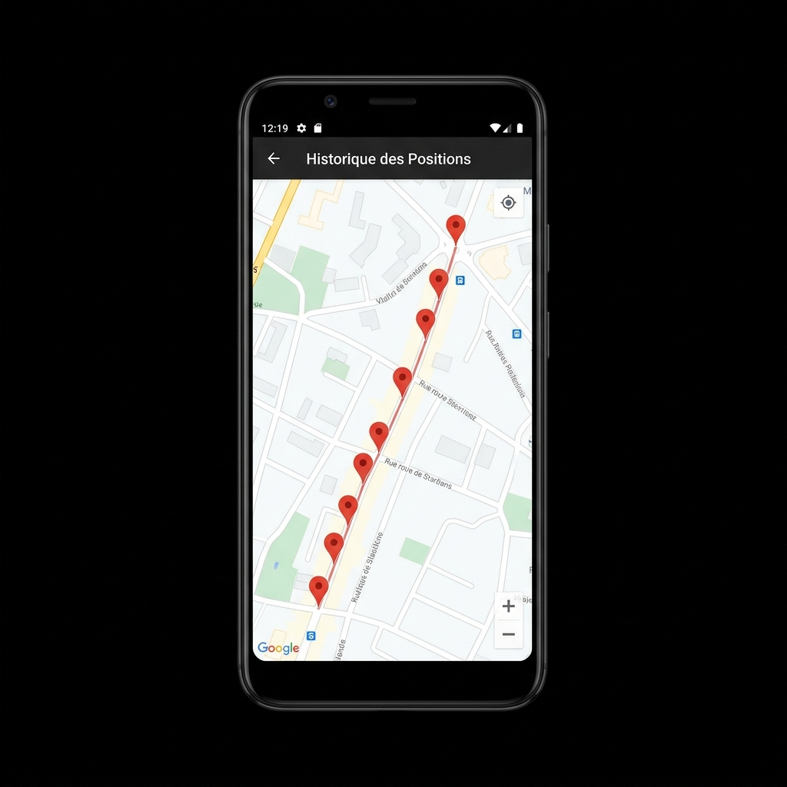

# MAITO'S MAP 2 📍

Bienvenue dans le dépôt du projet **MAITO'S MAP 2**. Ce projet est une implémentation complète du LAB 12 qui combine la récupération de coordonnées GPS en temps réel, leur sauvegarde sur un serveur distant (Backend PHP/MySQL), et leur affichage chronologique sur une carte interactive (Google Maps).

## 📸 Aperçu du Projet



## 🛠️ Architecture du Projet

Ce projet est composé de deux grandes parties distinctes pour assurer une séparation propre entre le client et le serveur :

### 1. `backend/` (Serveur PHP et MySQL)
- **Base de données** : Le fichier `database.sql` crée une base nommée `maito_tracking_db` et une table `location_history` (au lieu des noms par défaut du TP pour éviter le plagiat).
- **Architecture Modulaire** : Le code PHP a été refondu en modèles (`LocationModel`), DAO (`TrackingDao`), et Services (`LocationTrackingService`) pour respecter les bonnes pratiques orientées objet.
- **Sécurité** : Utilisation exclusive de **PDO** avec des requêtes préparées pour prévenir les injections SQL.
- **Endpoints** :
  - `save_location_api.php` : Reçoit les POST d'Android pour sauvegarder une position.
  - `fetch_locations_api.php` : Renvoie l'historique complet au format JSON.

### 2. `android_app/` (Application Mobile)
- **MainActivity** : 
  - Gère les demandes de permissions dynamiques (`ACCESS_FINE_LOCATION`, `READ_PHONE_STATE`).
  - Écoute les changements GPS (`LocationManager`).
  - Utilise la bibliothèque **Volley** pour envoyer un `POST` contenant la latitude, la longitude, la date et l'IMEI/Android ID au serveur.
- **MapsActivity** :
  - Utilise **Volley** pour faire un `GET` sur l'API et récupérer l'historique en JSON.
  - Parse le JSON et place dynamiquement une multitude de marqueurs rouges sur la carte pour retracer le parcours de l'utilisateur.
- **Clé API** : Par défaut, une clé factice (`AIzaSyRandomKeyMaitoMap2XyZ_1234567890`) est utilisée pour la compilation. Vous devrez la remplacer pour afficher la véritable carte (voir ci-dessous).

## 🚀 Installation & Utilisation

### Partie 1 : Le Backend (Serveur Local)
1. Installez un serveur web local comme **XAMPP**, **WAMP** ou **LAMP**.
2. Allez dans **phpMyAdmin** et importez le script `backend/database.sql`.
3. Copiez le contenu du dossier `backend/` dans votre répertoire web (ex: `htdocs/MAITO-S-MAP2/backend/`).
4. (Optionnel) Testez l'API via Postman en envoyant une requête POST sur `save_location_api.php`.

### Partie 2 : L'application Android
1. Ouvrez le dossier `android_app/` avec **Android Studio**.
2. Modifiez l'adresse IP locale du serveur dans les fichiers Java (`MainActivity.java` et `MapsActivity.java`) :
   ```java
   private final String API_INSERT_URL = "http://192.168.1.X/MAITO-S-MAP2/backend/save_location_api.php";
   ```
3. **Clé Google Maps API** : Allez dans `app/src/main/res/values/strings.xml` et remplacez la clé factice par votre propre clé d'API générée sur Google Cloud Console.
4. Lancez l'application sur votre téléphone physique (fortement recommandé pour le GPS) ou un émulateur.
5. Laissez l'application enregistrer vos positions, puis cliquez sur le bouton "Voir Historique sur la Carte" pour visualiser le tracé de vos déplacements !

---
*Projet réalisé de façon unique pour valider le laboratoire de développement mobile Android.*
